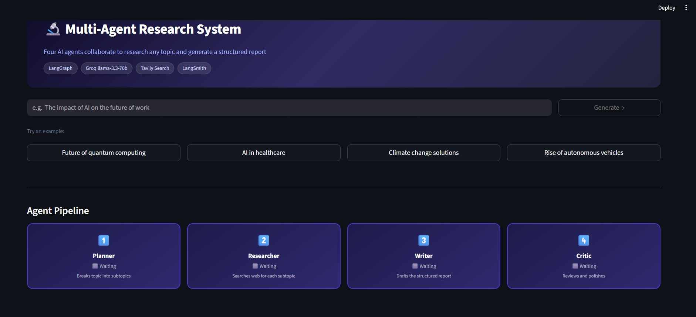

# Multi-Agent Research & Report Generator

Give it a topic, get back a structured research report. Four AI agents handle the whole thing — planning, searching, writing, and reviewing — without you having to babysit any of it.

Built this as a portfolio project to get hands-on with LangGraph and multi-agent orchestration. Ended up being a pretty useful tool on its own.



---

## How it works

The pipeline runs four agents in sequence, each one passing its output to the next:

**Planner** takes your topic and breaks it into 4–6 focused subtopics — the kind of breakdown you'd do manually before starting a research session.

**Researcher** searches the web for each subtopic using Tavily, then summarizes the raw results using the LLM. This two-step approach (search → summarize) keeps the quality high instead of just dumping raw snippets into the next prompt.

**Writer** takes all the research and writes a structured Markdown report — executive summary, one section per subtopic, conclusion.

**Critic** reads the draft and rewrites anything that's vague, repetitive, or poorly structured. If the critic fails for any reason, it falls back to the draft so the pipeline never breaks silently.

The whole thing is wired together using LangGraph's `StateGraph`, where each agent only updates the fields it owns — nothing more.

---

## Stack

- **LangGraph** — agent orchestration and state management
- **Groq** (`llama-3.3-70b-versatile`) — LLM for all four agents
- **Tavily** — web search API (AI-optimized, returns clean results)
- **Streamlit** — frontend dashboard
- **LangSmith** — tracing and monitoring (optional but useful)

---

## Setup

Clone the repo and create a virtual environment:

```bash
git clone https://github.com/Anoop-2752/multi-agent-research.git
cd multi-agent-research
python -m venv venv
venv\Scripts\activate      # Windows
# source venv/bin/activate  # Mac/Linux
pip install -r requirements.txt
```

Copy the env template and fill in your keys:

```bash
cp .env.example .env
```

```env
GROQ_API_KEY=your_key_here
TAVILY_API_KEY=your_key_here
LANGCHAIN_API_KEY=your_key_here        # optional, for LangSmith tracing
LANGCHAIN_TRACING_V2=true
LANGCHAIN_PROJECT=multi-agent-research
```

All three APIs have free tiers. Groq and Tavily are the only ones required to run.

---

## Running it

**Streamlit UI:**
```bash
streamlit run app.py
```

**Terminal (no UI):**
```bash
python main.py --topic "Impact of AI on healthcare"
python main.py --topic "Quantum computing" --output report.txt
```

---

## Project structure

```
├── agents/
│   ├── planner.py       # topic → list of subtopics
│   ├── researcher.py    # subtopics → web search + summaries
│   ├── writer.py        # research → markdown draft
│   └── critic.py        # draft → polished final report
├── graph/
│   └── workflow.py      # LangGraph StateGraph wiring all agents
├── tools/
│   └── search.py        # Tavily search wrapper
├── app.py               # Streamlit frontend
└── main.py              # CLI entry point
```

---

## API usage per run

Each report generation makes roughly 7–9 calls to Groq and 4–6 searches via Tavily. Well within the free tier limits for both — Tavily gives 1000 searches/month free, Groq is effectively unlimited for this use case.

---

## LangSmith tracing

If you set `LANGCHAIN_TRACING_V2=true` and add your LangSmith key, every run gets traced automatically — you can see each LLM call, the inputs/outputs, latency per step, and token usage. Useful for debugging prompts.
